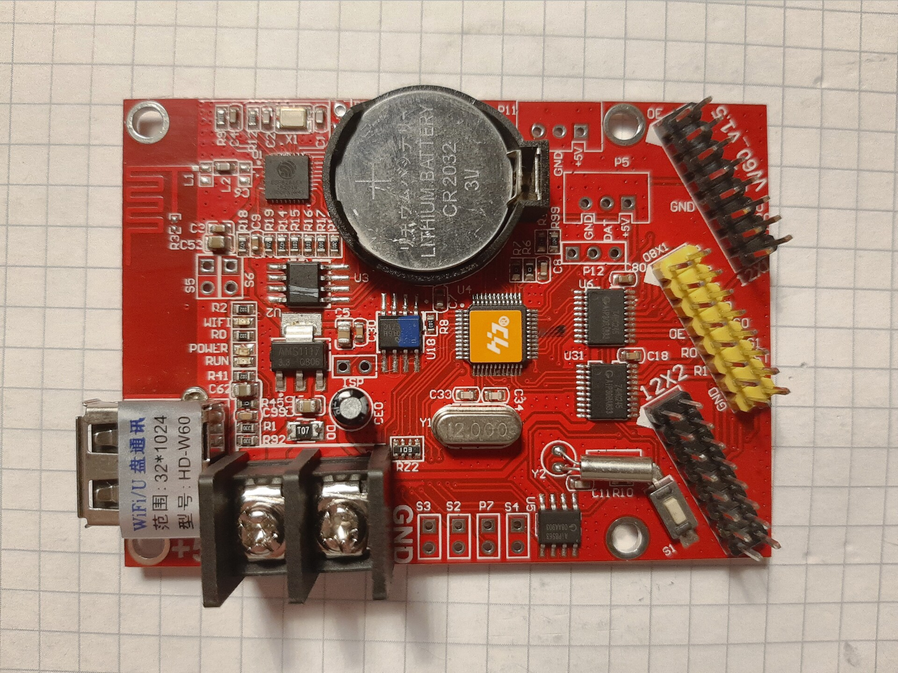
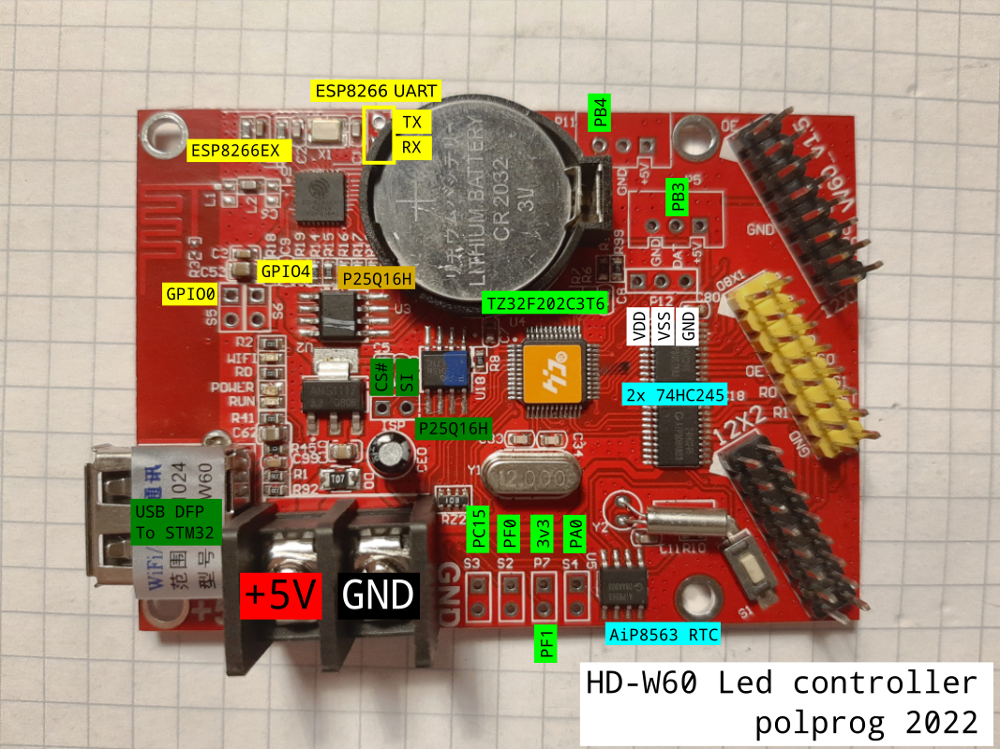

# HD-W60 reverse engineering

## Todo

- Establish JTAG/SWD communication with TZ32
- Find out LED assignments

HD-W60 is a small, affordable LED controller board available from various online outlets. This repository aims to document, reverse engineer, and provide development tools the board, as it is a feature rich Wi-Fi enabled device. 





# Hardware

HD-W60 v1.5 hardware contains the following MCUs and peripherals:

- TZ32F202C3T6 (For now I assume it is an STM32xxxxx clone)
- ESP8266EX (A well known WiFi enabled SoC)
- AiP8563 I²C RTC with backup battery
- 74HC245 output drivers




The board has several IO ports listed below in no particular order:

- LED panel connections (2x HUB12 and 1x HUB8)
- USB host port
- Several GPIOs broken out on various headers
- ESP8266 USART (P20 header)

I believe that it can be turned into a powerful IoT development board if it is possible to run custom code on it.

# Peripheral structure

- U4 TZ32F202C3T6
  - U5 AiP8563
  - U18 P25Q16H
  - U6, U31 74HC245
- U1 ESP8266EX
  - U3 P25Q16H

# P20 header

| Pin | ESP8266 | TZ32 |
|-----|---------|------|
| 1   | U0TXD   | PA14 (JTCK) via jumper R6 |
| 2   | U0RXD   | PA15 (JTDI) via jumper R7 |

P20 header is linked to UART on ESP826 and JTAG (partially) on TZ32.


# STM32 peripherals

TZ32F202C3T6 has no analog in the STM32 part numbering scheme, so it is hard to say anything about it. The closest match I found was SMT32F302CBT6. Pin names below are matched to an LQFP48 package of the afromentioned STM32.

The TZ32 drives two output drivers for the LED panels with U31 and U6 74HC245. The USB port is connected to this MCU. The microcontroller is also connected to the U18 P25Q16H serial flash. 

## JTAG/SWD

TZ32 JTAG is available on P20, P5 and P11 headers

| JTAG pin   | SWD pin |  Location  |
|------------|---------|------------|
| TDI (PA15) |         | P20 pin 2  |
| TDO (PB3)  |         | P5 "DAT"   |
| TMS (PA13) | SWDIO   | S1 top or R10 |
| TCK (PA14) | SWCLK   | P20 pin 1  |
| TRST (PB4) |         | P11 "DAT"  | 


## Headers 

### P12 (power)

| Pin | Function |
|-----|----------
| 1   | Vdd |
| 2   | Vss |
| 3   | GND |

### ISP (U18 serial flash programming header)

| Pin | Function |
|-----|----------
| 1   | CS# |
| 2   | SI  |

SO is not connected, readot must be done via a SOIC clip.

### P5

| Pin | Function |
|-----|----------
| 1   | +5V |
| 2   | PB3 |
| 3   | GND |

### P11

| Pin | Function |
|-----|----------
| 1   | +5V |
| 2   | PB4 |
| 3   | GND |

### Sx headers

Pin 2 is ground on all 3. All 3 pins pulled up to 3v3

| Header | Pin 1 function |
|-----|----------
| S2   | PF0  |
| S3   | PC15 |
| S4   | PA0  |


# ESP8266

Only U2 serial flash is connected to the ESP8266

## Boot mode

GPIO0 is broken out on header S5 and pulled up. GPIO2 is pulled up. This means the boot mode can be selected between booting from flash (S5 open) and UART programming mode (S5 closed)

| GPIO0 | Mode |
|-------|------|
| 1     | Flash startup |
| 0     | UART programming |

## UART

The UART interface opearates at 230400 bps 8N1. There is no bootlog, the device periodically sends a burst of binary and ascii data containing the SSID, then a series of AT commands

```
AT+SETBAUD=230400
AT+SETBAUD?
AT+GETSTATUS=0
AT+VERSION?
```
and then repeats`AT+SETBAUD?` but does not react to any input.


## Headers

### Sx headers

Pin 2 is ground on all 3. All 3 pins pulled up to 3v3

| Header | Pin 1 function |
|------|----------
| S5   | GPIO0  |
| S6   | GPIO4  |


# Licence


[CC0](http://creativecommons.org/publicdomain/zero/1.0/") - to the extent possible under law, the person who associated CC0 with this 
work has waived all copyright and related or neighboring rights to this work.
