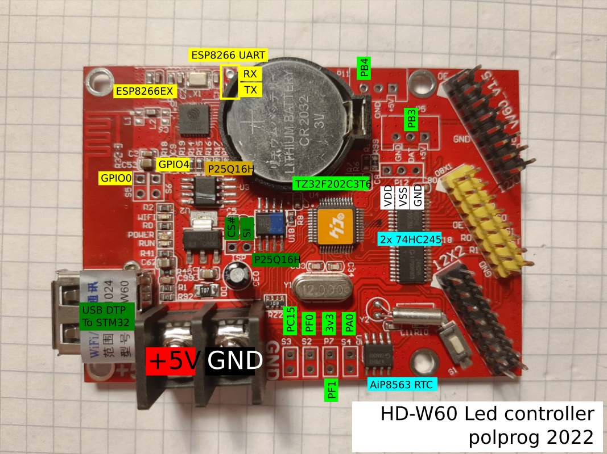

# HD-W60 reverse engineering

## Current Progress

TZ32: Very likely a DSP by cc-century.com

ESP8266: Programming connection made.


## Todo

- Identify what MCU TZ32 really is.
- Find out LED assignments
- ESP8266 hello world application
- Update SVG drawing

HD-W60 is a small, affordable LED controller board available from various online outlets. This repository aims to document, reverse engineer, and provide development tools the board, as it is a feature rich Wi-Fi enabled device. 


# Hardware

HD-W60 v1.5 hardware contains the following MCUs and peripherals:

- TZ32F202C3T6 (unknown MCU - needs to be identified)
- ESP8266EX (A well known WiFi enabled SoC)
- AiP8563 I²C RTC with backup battery
- 74HC245 output drivers
- 2x 25Q16 High speed QSPI flash




The board has several IO ports listed below in no particular order:

- LED panel connections (2x HUB12 and 1x HUB8)
- USB host port
- Several GPIOs broken out on various headers
- ESP8266 USART (P20 header)

I believe that it can be turned into a powerful IoT development board if it is possible to run custom code on it.

# Peripheral structure

- U4 TZ32F202C3T6
  - U5 AiP8563
  - U18 P25Q16H
  - U6, U31 74HC245
- U1 ESP8266EX
  - U3 P25Q16H

# P20 header

| Pin | ESP8266 | TZ32 |
|-----|---------|------|
| 1   | U0TXD   | 37 via jumper R6 |
| 2   | U0RXD   | 38 via jumper R7 |

P20 header is linked to UART on ESP826 and some IO pins (likely UART) on TZ32.


# TZ32

Despite it's extremely similar name, the TZ32F202C3T6 is not an STM32 clone chip, or at least it is not pin compatible. The microcontroller needs to be identified.

No information could be found online searching for a "TZ32" microcontroller.

The TZ32 drives two output drivers for the LED panels with U31 and U6 74HC245. The USB port is connected to this MCU. The microcontroller is also connected to the U18 P25Q16H serial flash. 

## Flash

The external flash image contains a uboot reference at the very beginning, but no ARM code at all. The rest of the flash contains some graphic images and other data.

## UART

There is what looks to be a programming header P12 which is unlabeled and unpopulated. Pins 35 and 36 from TZ32 go there. It has a UART port operating at 115200 8N1. The log is in the file uart_tz32.log

| Pin | Function |
|-----|----------
| 1   | TX  |
| 2   | RX  |
| 3   | GND |


## Headers 

### P12 (power)

| Pin | Function |
|-----|----------
| 1   | Vdd |
| 2   | Vss |
| 3   | GND |

### ISP (U18 serial flash programming header)

| Pin | Function |
|-----|----------
| 1   | CS# |
| 2   | SI  |

SO is not connected, readot must be done via a SOIC clip.

### P5

| Pin | Function |
|-----|----------
| 1   | +5V |
| 2   | xxx |
| 3   | GND |

### P11

| Pin | Function |
|-----|----------
| 1   | +5V |
| 2   | xxx |
| 3   | GND |

### Sx headers

Pin 2 is ground on all 3. All 3 pins pulled up to 3v3

| Header | Pin 1 function |
|-----|----------
| S2   | xxx  |
| S3   | xxx  |
| S4   | xxx  |


# ESP8266

## SPI flash

Only U2 serial flash is connected to the ESP8266. This SPI flash contains valid Xtensa code which seems to be a custom bootloader + application.

It is possible to read it out (TL866 works, flashrom does not) while GPIO0 is shorted to ground with header S5. (Short S5, connect power, connect programming clip, read). The P25Q16H is not supported by minipro, but it can be forced to read as a different 25x16 spi flash. Programming was not attempted yet.

## Boot mode

GPIO0 is broken out on header S5 and pulled up. GPIO2 is pulled up. This means the boot mode can be selected between booting from flash (S5 open) and UART programming mode (S5 closed)

| GPIO0 | Mode |
|-------|------|
| 1     | Flash startup |
| 0     | UART programming |

A successful programming connection was made with esptool.

## UART

UART0 is broken out on the P20 header.
The UART0 interface opearates at 230400 bps 8N1. There is no bootlog, the device sends a burst of binary and ascii data containing the SSID, then a series of AT commands

```
AT+SETBAUD=230400
AT+SETBAUD?
AT+GETSTATUS=0
AT+VERSION?
```
and then repeats `AT+SETBAUD?` but does not react to any input.


## Headers

### Sx headers

Pin 2 is ground on all 3. All 3 pins pulled up to 3v3

| Header | Pin 1 function |
|------|----------
| S5   | GPIO0  |
| S6   | GPIO4  |


# Licence


[CC0](http://creativecommons.org/publicdomain/zero/1.0/") - to the extent possible under law, the person who associated CC0 with this 
work has waived all copyright and related or neighboring rights to this work.
